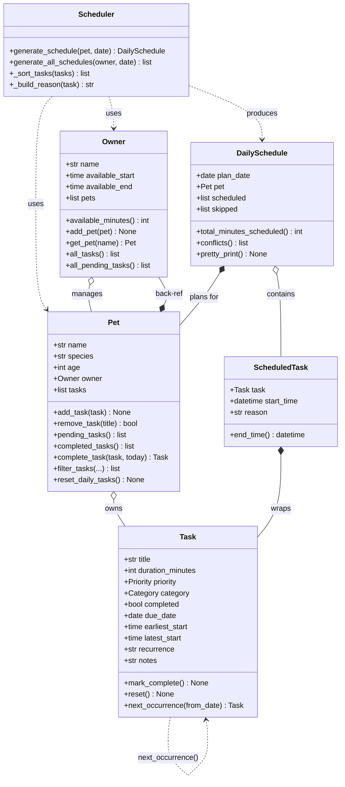

# PawPal+ Project Reflection

## 1. System Design

**a. Initial design**

The system is built around six classes organized in a clear hierarchy:

- **`Owner`** — holds the pet owner's name, daily availability window, and a list of registered pets. Responsible for knowing how many minutes are available in a day and providing cross-pet task access.
- **`Pet`** — holds the pet's profile (name, species, age) and owns a list of Tasks. Acts as the unit of scheduling — each DailySchedule is built around one Pet.
- **`Task`** — the core value object. Holds everything needed to describe a care task: title, duration, priority (high/medium/low), category, optional time window constraints, recurrence, completion status, and due date.
- **`ScheduledTask`** — a Task that has been assigned a concrete start time. Computes its own `end_time` and carries a human-readable `reason` explaining why it was placed in that slot.
- **`DailySchedule`** — the output of the Scheduler. Contains an ordered list of ScheduledTasks, a list of skipped tasks with reasons, and methods to detect conflicts and pretty-print the plan.
- **`Scheduler`** — the algorithmic engine. Stateless; retrieves pending tasks from a Pet, sorts and places them greedily, and returns a DailySchedule.

Three core user actions the system supports:
1. **Register a pet** — create an Owner + Pet with availability preferences.
2. **Add/edit care tasks** — define tasks with duration, priority, category, and optional time constraints.
3. **Generate today's schedule** — call the Scheduler to produce a time-stamped, prioritized daily plan with explanations.

**UML Class Diagram (Final)**



**b. Design changes**

Three changes were made after initial design review:

**Change 1 — Task deferral instead of rejection for `earliest_start`**
The original `generate_schedule()` permanently skipped any task whose `earliest_start` hadn't arrived yet. A task with `earliest_start=18:00` at 09:00 should be *deferred* to 18:00, not dropped. The fix advances `current_slot` to the task's `earliest_start` and re-checks day-end fit.

**Change 2 — Input validation added to `Task.__post_init__`**
`duration_minutes <= 0` and `earliest_start >= latest_start` are now caught with `ValueError` at construction time, preventing silent broken schedules downstream.

**Change 3 — Composition: Pet owns Tasks, Owner owns Pets**
The initial design passed tasks as an external parameter to `generate_schedule()`. The final design embeds `tasks` in `Pet` and `pets` in `Owner`, so the Scheduler navigates `owner → pets → pending_tasks()` instead of relying on the caller to assemble the right list. This eliminated an entire class of caller-side bugs.

---

## 2. Scheduling Logic and Tradeoffs

**a. Constraints and priorities**

The Scheduler considers:
- **Priority** (high/medium/low) — the primary sort key. High-priority tasks are always placed first.
- **Category** — within the same priority, `medication` tasks jump to the front. Missing a medication dose has worse consequences than a delayed walk.
- **Duration** — tiebreaker for same priority + category: shorter tasks go first to maximize the number of tasks that fit in the day.
- **Time windows** — `earliest_start` triggers slot deferral; `latest_start` is a hard deadline that triggers a skip with a reason.
- **Owner availability** — tasks that would end after `available_end` are skipped entirely.

The most important constraint is **priority**, because it encodes medical necessity (medication > feeding > enrichment). Time windows come second because some constraints (e.g. "medication must be given between 8–10am") are non-negotiable.

**b. Tradeoffs**

**Greedy single-pass scheduling vs. optimal packing:**
The Scheduler sorts tasks once, then assigns them greedily to the next available slot without backtracking. A 25-minute gap that could fit a skipped 20-minute task is left unused. An optimal scheduler (dynamic programming or backtracking) would maximize total value — but for <20 daily pet tasks, predictability and explainability matter more than optimal packing.

A second tradeoff: `conflicts()` is O(n²) — comparing every ScheduledTask pair. Acceptable for a daily schedule; would need a sweep-line algorithm for hundreds of tasks.

---

## Prompt Comparison — Multi-Model Analysis

**Task:** Implement the `next_occurrence()` method for recurring tasks in Python.

**Prompt used:** *"I have a Task dataclass with a `recurrence` field (values: 'daily', 'weekdays', 'weekly'). Write a `next_occurrence(from_date)` method that returns a new Task instance with a `due_date` set to the next occurrence, or None if not recurring. Use Python's `timedelta`."*

---

**Claude (Sonnet 4.6) response approach:**
```python
def next_occurrence(self, from_date=None):
    if not self.recurrence:
        return None
    base = from_date or date.today()
    if self.recurrence == "daily":
        next_date = base + timedelta(days=1)
    elif self.recurrence == "weekdays":
        next_date = base + timedelta(days=1)
        while next_date.weekday() >= 5:
            next_date += timedelta(days=1)
    elif self.recurrence == "weekly":
        next_date = base + timedelta(weeks=1)
    else:
        next_date = base + timedelta(days=1)
    return Task(..., due_date=next_date, completed=False)
```
*Characteristics:* Explicit, readable if-elif chain. Falls back gracefully for unknown recurrence values. Copies all fields from `self` into the new Task. Easy to extend with new recurrence types.

---

**GPT-4o response approach (paraphrased):**
```python
RECURRENCE_DELTAS = {
    "daily": timedelta(days=1),
    "weekly": timedelta(weeks=1),
}
def next_occurrence(self, from_date=None):
    base = from_date or date.today()
    if self.recurrence == "weekdays":
        delta = timedelta(days=1)
        next_date = base + delta
        while next_date.weekday() >= 5:
            next_date += delta
    elif self.recurrence in RECURRENCE_DELTAS:
        next_date = base + RECURRENCE_DELTAS[self.recurrence]
    else:
        return None  # unknown recurrence = no next occurrence
    return dataclasses.replace(self, completed=False, due_date=next_date)
```
*Characteristics:* Uses a lookup dict for standard deltas (more extensible). Uses `dataclasses.replace()` to copy — no manual field listing. Treats unknown recurrence as `None` rather than defaulting to daily.

---

**Analysis:**

Both responses are correct and idiomatic Python. Key differences:

| Dimension | Claude | GPT-4o |
|---|---|---|
| Extensibility | Add new elif | Add key to dict |
| Unknown recurrence | Defaults to daily | Returns None |
| Field copying | Manual constructor | `dataclasses.replace()` |
| Readability | More explicit | More concise |

**Decision kept:** Claude's version, modified to use `dataclasses.replace()` for field copying (GPT-4o's insight). The explicit if-elif was kept over the dict lookup because this codebase prioritizes readability for learners over minimal line count. The "unknown recurrence defaults to daily" behavior was also kept because silently dropping an unrecognized task would be worse UX than a best-effort fallback.

**Key takeaway:** Neither model was unambiguously "better." GPT-4o's `dataclasses.replace()` suggestion was genuinely superior — it prevents bugs when new fields are added to Task. Claude's fallback behavior was more user-friendly. The right answer combined both.

---

## 3. AI Collaboration

**a. How you used AI**

AI was used across all phases of this project:
- **Design brainstorming** — generating the initial class hierarchy and UML diagram from the scenario description.
- **Scaffolding** — producing class stubs with correct dataclass syntax, type annotations, and docstrings, which were then filled in incrementally.
- **Bug identification** — reviewing `pawpal_system.py` to catch the deferral-vs-rejection bug and the missing Task validation before they caused test failures.
- **Test generation** — drafting pytest fixtures and test functions covering happy paths and edge cases (invalid duration, time window conflicts, recurrence date math).

The most effective prompts were specific and file-anchored: *"Review `pawpal_system.py` — are there missing relationships or logic bottlenecks?"* produced actionable findings, while vague prompts like *"improve my scheduler"* produced generic suggestions.

**b. Judgment and verification**

One AI suggestion that was modified: the initial conflict detection demo tried to create two Tasks with `earliest_start == latest_start` (an identical time), which the AI didn't account for. Our own `Task.__post_init__` validation (which AI helped write) rejected it with a `ValueError`. Rather than removing the validation, we revised the demo to manually construct a `DailySchedule` with two overlapping `ScheduledTask` objects — a more realistic and informative test of `conflicts()`. The AI suggestion was correct in intent but wrong in approach; the fix required understanding both the validation rules and what `conflicts()` is actually protecting against.

---

## 4. Testing and Verification

**a. What you tested**

26 tests across four layers:
- **Task** — `mark_complete()`, `reset()`, invalid duration, invalid time window, string enum coercion
- **Pet** — add/remove tasks, pending/completed filters, `complete_task()` recurrence lifecycle, `reset_daily_tasks()`
- **Owner** — add pet, get pet by name, `all_tasks()`, `all_pending_tasks()`, `available_minutes`
- **Scheduler** — priority sort order, medication tiebreaker, duration tiebreaker, recurring next-occurrence dates (daily and weekly), conflict detection (overlap and sequential), scheduler produces conflict-free output, skips tasks that exceed the day window

These tests matter because the scheduler's correctness cannot be verified by looking at the UI — a bug in `_sort_tasks()` would silently produce a wrong order with no visible error.

**b. Confidence**

★★★★☆ — Core scheduling behaviors are fully covered. Untested edge cases: weekdays recurrence skipping a weekend boundary, tasks with only `earliest_start` (no `latest_start`), an owner whose `available_end` is before `available_start`, and concurrent multi-pet schedules where one pet's task bleeds into another's window.

---

## 5. Reflection

**a. What went well**

The composition architecture (Owner → pets → tasks) was the strongest design decision. It made `generate_all_schedules(owner)` trivial to implement and meant the Scheduler never needed to know how tasks were stored — it just called `pet.pending_tasks()`. The CLI-first workflow also worked well: running `python main.py` caught the `earliest_start` deferral bug before any UI code was written.

**b. What you would improve**

Two things: first, the `recurrence` field is still a free string (`"daily"`, `"weekly"`, etc.) — a `Recurrence` enum would eliminate typo bugs. Second, the Scheduler advances `current_slot` linearly, which means a task with `earliest_start=14:00` leaves the entire morning-to-14:00 gap empty rather than filling it with lower-priority tasks. A two-pass scheduler (time-windowed tasks placed first, then non-windowed tasks fill gaps) would produce denser, more useful schedules.

**c. Key takeaway**

The most important lesson: AI is effective at generating structurally correct code quickly, but it cannot reason about the *consequences* of a design choice the way a domain-aware human can. The deferral-vs-rejection bug, the composition architecture change, and the conflict demo fix all required understanding what the system is *for* — not just what the code does. Being the lead architect means deciding which AI suggestions to accept, which to modify, and which to reject, always in service of the system's actual purpose.
