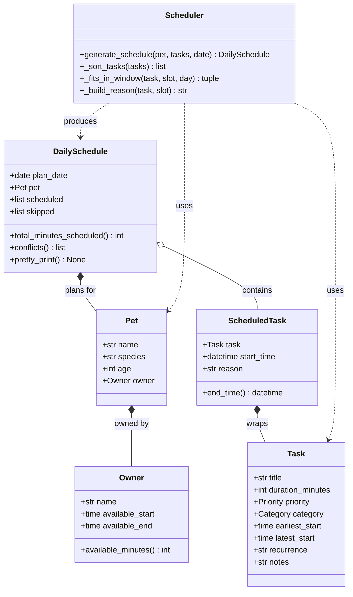

# PawPal+ Project Reflection

## 1. System Design

**a. Initial design**

The system is built around six classes organized in a clear hierarchy:

- **`Owner`** — holds the pet owner's name and daily availability window (start/end times). Responsible for knowing how many minutes are available in a day.
- **`Pet`** — holds the pet's profile (name, species, age) and a reference to its Owner. Acts as the context object passed into the scheduler.
- **`Task`** — the core value object. Holds everything needed to describe a care task: title, duration, priority (high/medium/low), category (walk, feeding, medication, etc.), optional time window constraints (earliest/latest start), and recurrence.
- **`ScheduledTask`** — a Task that has been assigned a concrete start time. Computes its own `end_time` and carries a human-readable `reason` explaining why it was placed in that slot.
- **`DailySchedule`** — the output of the scheduler. Contains an ordered list of ScheduledTasks, a list of skipped tasks with reasons, and methods to detect conflicts and pretty-print the plan.
- **`Scheduler`** — the algorithmic engine. Stateless; takes a Pet and a list of Tasks, runs the scheduling algorithm, and returns a DailySchedule. The key methods are `_sort_tasks()` (priority ordering) and `generate_schedule()` (greedy slot assignment).

Three core user actions the system supports:
1. **Register a pet** — create an Owner + Pet with availability preferences.
2. **Add/edit care tasks** — define tasks with duration, priority, category, and optional time constraints.
3. **Generate today's schedule** — call the Scheduler to produce a time-stamped, prioritized daily plan with explanations.

**UML Class Diagram**

**b. Design changes**

- Did your design change during implementation?
- If yes, describe at least one change and why you made it.

---

## 2. Scheduling Logic and Tradeoffs

**a. Constraints and priorities**

- What constraints does your scheduler consider (for example: time, priority, preferences)?
- How did you decide which constraints mattered most?

**b. Tradeoffs**

- Describe one tradeoff your scheduler makes.
- Why is that tradeoff reasonable for this scenario?

---

## 3. AI Collaboration

**a. How you used AI**

- How did you use AI tools during this project (for example: design brainstorming, debugging, refactoring)?
- What kinds of prompts or questions were most helpful?

**b. Judgment and verification**

- Describe one moment where you did not accept an AI suggestion as-is.
- How did you evaluate or verify what the AI suggested?

---

## 4. Testing and Verification

**a. What you tested**

- What behaviors did you test?
- Why were these tests important?

**b. Confidence**

- How confident are you that your scheduler works correctly?
- What edge cases would you test next if you had more time?

---

## 5. Reflection

**a. What went well**

- What part of this project are you most satisfied with?

**b. What you would improve**

- If you had another iteration, what would you improve or redesign?

**c. Key takeaway**

- What is one important thing you learned about designing systems or working with AI on this project?
