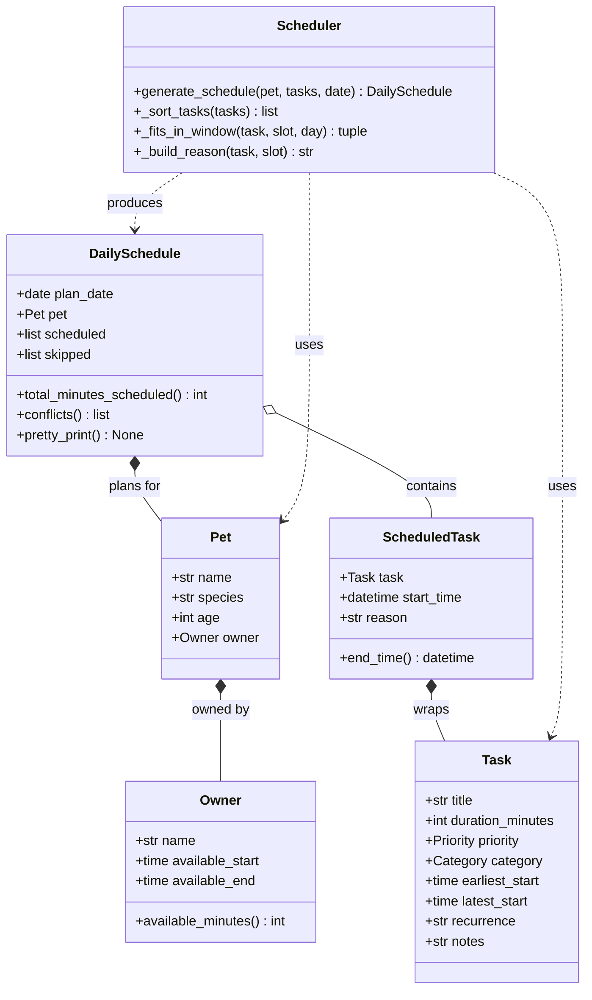

# PawPal+ Project Reflection

## 1. System Design

**a. Initial design**

The system is built around six classes organized in a clear hierarchy:

- **`Owner`** — holds the pet owner's name and daily availability window (start/end times). Responsible for knowing how many minutes are available in a day.
- **`Pet`** — holds the pet's profile (name, species, age) and a reference to its Owner. Acts as the context object passed into the scheduler.
- **`Task`** — the core value object. Holds everything needed to describe a care task: title, duration, priority (high/medium/low), category (walk, feeding, medication, etc.), optional time window constraints (earliest/latest start), and recurrence.
- **`ScheduledTask`** — a Task that has been assigned a concrete start time. Computes its own `end_time` and carries a human-readable `reason` explaining why it was placed in that slot.
- **`DailySchedule`** — the output of the scheduler. Contains an ordered list of ScheduledTasks, a list of skipped tasks with reasons, and methods to detect conflicts and pretty-print the plan.
- **`Scheduler`** — the algorithmic engine. Stateless; takes a Pet and a list of Tasks, runs the scheduling algorithm, and returns a DailySchedule. The key methods are `_sort_tasks()` (priority ordering) and `generate_schedule()` (greedy slot assignment).

Three core user actions the system supports:
1. **Register a pet** — create an Owner + Pet with availability preferences.
2. **Add/edit care tasks** — define tasks with duration, priority, category, and optional time constraints.
3. **Generate today's schedule** — call the Scheduler to produce a time-stamped, prioritized daily plan with explanations.

**UML Class Diagram**

**b. Design changes**

Two bugs were identified during design review and fixed before implementation:

**Change 1 — Task deferral instead of rejection for `earliest_start`**
The original `generate_schedule()` called `_fits_in_window()` and permanently skipped any task whose `earliest_start` hadn't arrived yet. This was wrong: a task with `earliest_start=18:00` scheduled at 09:00 should be *deferred* to 18:00, not thrown away. The fix advances `current_slot` to the task's `earliest_start` when the scheduler arrives too early, then re-checks whether the task still fits before the end of the day. The `_fits_in_window()` check is now reserved only for the `latest_start` hard deadline.

**Change 2 — Input validation added to `Task.__post_init__`**
No validation existed on `Task` construction. A `duration_minutes` of 0 or -5 would silently produce broken schedules, and an `earliest_start` after `latest_start` would create an impossible time window. Both are now caught with `ValueError` in `__post_init__`, which runs automatically after the dataclass `__init__` is generated. A third issue — `recurrence` being a free unvalidated string — was noted but left as a known limitation for now.

---

## 2. Scheduling Logic and Tradeoffs

**a. Constraints and priorities**

- What constraints does your scheduler consider (for example: time, priority, preferences)?
- How did you decide which constraints mattered most?

**b. Tradeoffs**

**Greedy single-pass scheduling vs. optimal packing:**
The Scheduler uses a greedy algorithm: it sorts tasks once by priority, then assigns them in order to the next available slot. This means the first high-priority task "claims" its time, and everything else fills in around it. It does not backtrack or try alternative orderings to fit more tasks in.

The tradeoff: a greedy scheduler may leave a 25-minute gap that could fit a 20-minute low-priority task, but won't go back and reorder to use it. An optimal scheduler (e.g. using dynamic programming or backtracking) would find the maximum-value packing — but for a daily pet care schedule with <20 tasks, the added complexity is not worth it. Pet owners benefit more from a fast, predictable, explainable schedule than a theoretically optimal one.

A second tradeoff: `conflicts()` is O(n²) — it compares every pair of ScheduledTasks. For a daily schedule this is fine (26ms for 26 tests total), but would not scale to hundreds of tasks without replacing it with a sweep-line algorithm.

---

## 3. AI Collaboration

**a. How you used AI**

- How did you use AI tools during this project (for example: design brainstorming, debugging, refactoring)?
- What kinds of prompts or questions were most helpful?

**b. Judgment and verification**

- Describe one moment where you did not accept an AI suggestion as-is.
- How did you evaluate or verify what the AI suggested?

---

## 4. Testing and Verification

**a. What you tested**

- What behaviors did you test?
- Why were these tests important?

**b. Confidence**

- How confident are you that your scheduler works correctly?
- What edge cases would you test next if you had more time?

---

## 5. Reflection

**a. What went well**

- What part of this project are you most satisfied with?

**b. What you would improve**

- If you had another iteration, what would you improve or redesign?

**c. Key takeaway**

- What is one important thing you learned about designing systems or working with AI on this project?
